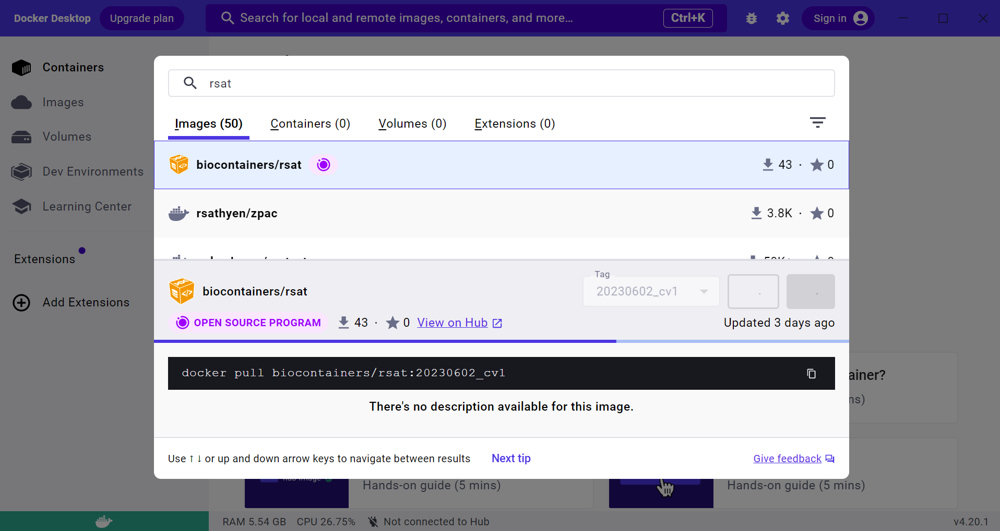

```{r setup, include=FALSE}
library(knitr, warn.conflicts = FALSE)

knitr::opts_chunk$set(
  echo = TRUE, 
  eval = FALSE, 
  cache = TRUE, 
  message = FALSE, 
  warning = FALSE, 
  comment = "",  
  fig.align = "center",
  fig.width = 7, 
  fig.height = 5,
  out.width = "90%",
  fig.path = "figures/")
```

****************************************************************
# Introduction

This page explains how to install and run a Docker container of the Regulatory Sequence Analysis Tools. 

# Requirements

## Availability

RSAT Docker containers are available at https://hub.docker.com/r/biocontainers/rsat/tags 

Each release corresponds to a tag from https://github.com/rsa-tools/rsat-code/tags

## Operating systems

Docker containers have so far been tested on Linux, Windows and macOS (Intel) systems. 

Please let us know or send us a PR at https://github.com/rsa-tools/installing-RSAT if you succeed in running it on other settings.

## Docker 

To run containers you must have Docker installed in your system. 

You can find instructions for installing the Docker (Server) engine on **Linux** at https://docs.docker.com/engine/install/#server .

On **Windows**, our recommended procedure is to i) install the Windows Subsystem for Linux (WSL) and then ii) the Docker engine:

 * The installation of WSL is simple, as it you can fetch it from the Microsoft Store for free (read more [here](https://learn.microsoft.com/en-us/windows/wsl/install) and 
[here](https://devblogs.microsoft.com/commandline/the-windows-subsystem-for-linux-in-the-microsoft-store-is-now-generally-available-on-windows-10-and-11/)).
 * The installation of Docker engine within WSL is explained at https://dev.to/felipecrs/simply-run-docker-on-wsl2-3o8 and https://docs.docker.com/engine/install/ubuntu .

Our community have also succeeded in running the RSAT container with 
[Docker Desktop](https://www.docker.com/products/docker-desktop)
for **MacOS** (also available for Linux and Windows systems).

<!--
$> docker -v
Docker version 24.0.2, build cb74dfc

$> system_profiler SPSoftwareDataType SPHardwareDataType
Software:
    System Software Overview:
      System Version: macOS 11.7.2 (20G1020)
      Kernel Version: Darwin 20.6.0
      Boot Volume: Macintosh HD
      Secure Virtual Memory: Enabled
-->

<!--
**Note:** see [instructions](https://stackoverflow.com/questions/61530874/docker-how-do-i-add-myself-to-the-docker-users-group-on-windows) to add your Windows user to the 'docker-users' group, you will need admin privileges. -->

****************************************************************

# Binding local folders

Some examples below require binding local folders. These allow you to keep persistent
files outside the Docker container, which you access even if the container is turned off.
They are listed here:

| folder   | description | creation command |
| -------- | ----------- | ---------------- |
| rsat_data/genomes | installed genomes, writable by anybody | `mkdir -p rsat_data/genomes; chmod -R a+w rsat_data` |
| rsat_results/ | saved results, writable by anybody | `mkdir rsat_results; chmod -R a+w rsat_results` |
| user_motifs/ | contains motifs in [TRANSFAC](https://rsat.eead.csic.es/plants/help.convert-matrix.html#io_format) format, readable by anybody | |

# Installation instructions

If you want to fetch a ready-to-run Docker container with RSAT please select a tagged version from https://hub.docker.com/r/biocontainers/rsat/tags . For convenience, in the steps below 
we set an **environmental variable** named `RSATDOCKER` with the chosen version:

 4.1. Download a container (this will take ~8GB of your filesystem):

        # set env variable with tag at the Linux/WSL terminal
        export RSATDOCKER="biocontainers/rsat:20240507_cv1"          
        
        # actually pull container image
        docker pull $RSATDOCKER
        
<!--This can also be done from the Docker Desktop app, as shown in the figure:
     -->

 4.2. Create local folders for input data and results, outside the container, as explained on section [Binding local folders](#binding-local-folders). The next example requires folders `rsat_data/` and `rsat_results/` in the current location (env variable `$PWD`). **Note:** you can place these folders anywhere in your system, but please check their paths and modify them in **step 3** accordingly:
 
 4.3. Launch Docker RSAT container. Note that the local folders from **step 2** are mounted as volumes in the container. If you changed their locations please adjust their paths to the right of the colons. **Note:** after this instruction, all other commands should be typed and executed at the container's terminal:

        docker run --rm -v $PWD/rsat_data:/packages/rsat/public_html/data/ -v $PWD/rsat_results:/home/rsat_user/rsat_results -it $RSATDOCKER
        
        # you should see a warning that can be safely ignored: 
        #
        # * Starting Apache httpd web server apache2
        # (13)Permission denied: AH00091: apache2: could not open error log file /var/log/apache2/error.log.
        # AH00015: Unable to open logs
        # Action 'start' failed.
        # The Apache error log may have more information


 4.4. Download an organism from public RSAT servers, such as the Plants server. Other available servers are http://fungi.rsat.eu, http://metazoa.rsat.eu, http://protists.rsat.eu and http://teaching.rsat.eu

        download-organism -v 2 -org Prunus_persica.Prunus_persica_NCBIv2.60 -server https://rsat.eead.csic.es/plants

 4.5. Testing:

        cd rsat_results 
        make -f ../test_data/peak-motifs.mk RNDSAMPLES=2 all

 4.6. To install any organism, please follow the instructions at [managing-RSAT](https://rsa-tools.github.io/managing-RSAT/genome_installation/install_organisms_FASTA_GTF.html).

 4.7. To connect to RSAT Web server running from Docker container (Linux only): 

        # to start the Docker Web server launch the container and do (check password in Dockerfile):
        sudo service apache2 restart
        hostname -I # should return IP address

        # finally open the following URL in your browser, using the IP address, ie http://172.17.0.2/rsat
 
# Step-by-step interactive tutorial

Once you installation is done you can follow our protocol on using a Docker container interactively to carry out motif analysis in co-expression networks at: https://eead-csic-compbio.github.io/coexpression_motif_discovery/peach/Tutorial.html 

# Calling RSAT tools non-interactively

In addition to logging into the Docker container as explained in the previous sections,
you can also call individual tools from the terminal non-interactively: 

    docker run $RSATDOCKER rsat
    docker run $RSATDOCKER rsat peak-motifs -h
    # short form
    docker run $RSATDOCKER peak-motifs -h

The container ships with **pre-installed motif databases** 
(see <https://github.com/rsa-tools/motif_databases>), which can be used by different tools 
to scan sequences or to annotate discovered DNA motifs. You can see which collections are 
available with:

    docker run $RSATDOCKER ls /packages/motif_databases
    
    # to check files in a particular database or collection
    docker run $RSATDOCKER ls /packages/motif_databases/footprintDB

The container ships with **no installed genomes**, but you can easily copy them
from a Web instance, such as [RSAT::Plants](<https://rsat.eead.csic.es/plants/htmllink.cgi?title=RSAT-Data&file=data>),
as explained in step 4.4:

    docker run -v $PWD/rsat_data:/packages/rsat/data $RSATDOCKER download-organism -v 2 -org Prunus_persica.Prunus_persica_NCBIv2.60 -server https://rsat.eead.csic.es/plants

You can now check whether the genomes are available with:

    docker run -v $PWD/rsat_data:/packages/rsat/data $RSATDOCKER supported-organisms
    
## peak-motifs examples

The next examples show how to run [*peak-motifs*](https://doi.org/10.1093/nar/gkr1104) non-interactively with a user-provided FASTA file (`test.fa`) in the current directory:

    docker run -v $PWD:/home/rsat_user -v $PWD/rsat_results:/home/rsat_user/out $RSATDOCKER peak-motifs -i test.fa -outdir out -prefix test
    
**Note:** you can visualize the results by opening local folder `$PWD/rsat_results` with your browser.

Two more examples follow, were any discovered motifs are compared to pre-installed database ([footprintDB](https://footprintdb.eead.csic.es)) and to user-provided motifs in [TRANSFAC](https://rsat.eead.csic.es/plants/help.convert-matrix.html#io_format) format, 
saved in a file named `mymotifs.tf`:  

    docker run -v $PWD:/home/rsat_user -v $PWD/rsat_results:/home/rsat_user/out $RSATDOCKER peak-motifs -i test.fa -outdir out -prefix test -motif_db footDB transfac /packages/motif_databases/footprintDB/footprintDB.plants.motif.tf
    
    docker run -v $PWD:/home/rsat_user -v $PWD/rsat_results:/home/rsat_user/out -v $PWD/user_motifs:/home/rsat_user/ext_motifs  $RSATDOCKER peak-motifs -i test.fa -outdir out -prefix test -motif_db custom transfac /home/rsat_user/ext_motifs/mymotifs.tf


# Dockerfiles

Dockerfiles for the containers at [biocontainers/rsat](https://hub.docker.com/r/biocontainers/rsat) 
can be found at https://github.com/BioContainers/containers/tree/master/rsat

Those are based on a standalone Dockerfile, available at https://github.com/rsa-tools/rsat-code/tree/master/docker, which we use for development and testing.

