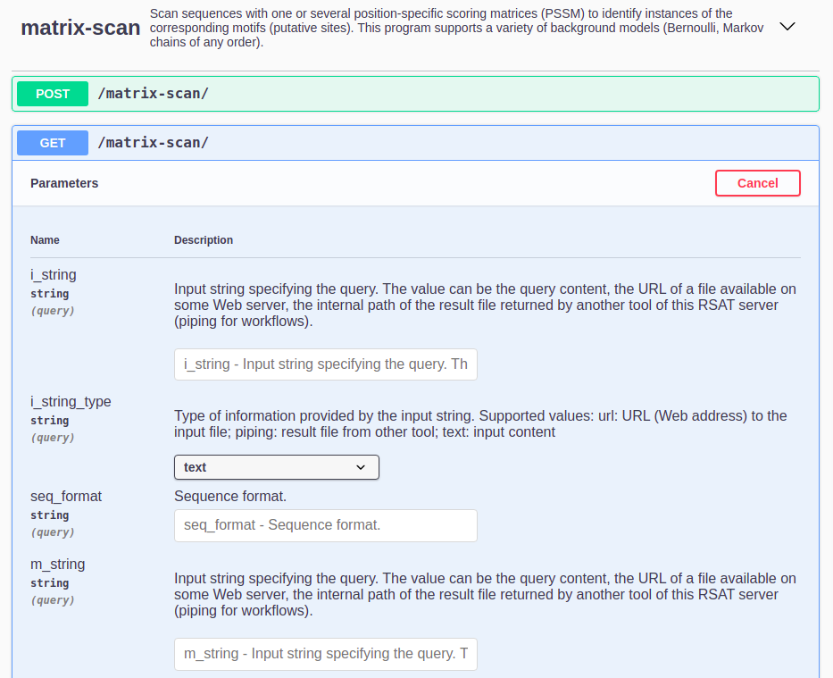
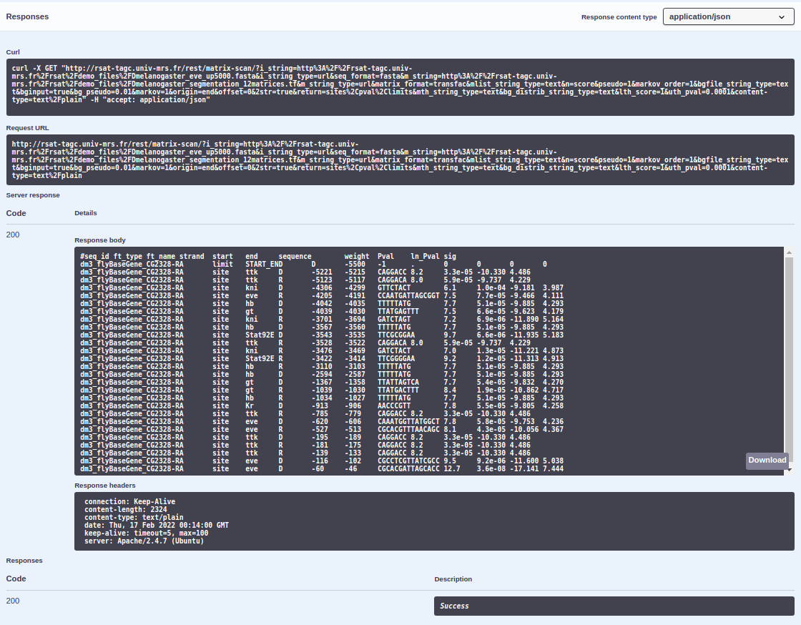

```{r setup, include=FALSE}
library(knitr, warn.conflicts = FALSE)

knitr::opts_chunk$set(
  echo = TRUE, 
  eval = FALSE, 
  cache = TRUE, 
  message = FALSE, 
  warning = FALSE, 
  comment = "",  
  fig.align = "center",
  fig.width = 7, 
  fig.height = 5,
  out.width = "90%",
  fig.path = "figures/")
```

****************************************************************
# Introduction

This tutorial explains how to install the complete [Regulatory Sequence Analysis Tools (RSAT)](<http://rsat.eu/>) suite via GitHub or from a tarball archive in Linux or Mac OS X systems.
This RSAT distribution contains: (i) the _RSAT command line tools_, (ii) the _web server_ and (iii) the _web services_.

****************************************************************
# Requirements {.tabset .tabset-fade}

## Linux {.unlisted .unnumbered}
<br>

1. **Operating system**. If your Linux operating system (OS) is not Ubuntu some adaptation of the scripts used in the installation step will be necessary (e.g. system libraries).
2. **Package manager**. The `apt-get` package manager should be already installed in the command line and it is recommended to update to the latest version.
3. **Git and Git LFS**. If you are installing the GitHub repositories the `git` and `git-lfs` applications should be available in the command line. You can install `git` from [here](https://git-scm.com/downloads) and `git lfs` from [here](https://git-lfs.github.com/).

<br>

****************************************************************

## Mac OS X {.unlisted .unnumbered}
<br>

1. **Operating system**. This RSAT installation protocol is aimed at Mac OS X in Mojave (v10.14) and Catalina (v10.15). RSAT installation in previous Mac OS X versions is feasible but a manual installation of packages (e.g. `brew` packages) is needed and it is beyond the scope of this tutorial.
2. **Xcode**. The complete version of the _Xcode_ application should already be installed in your Mac OS X. You can download and install _Xcode_ from [here](https://developer.apple.com/download/). Please be aware that downloading _Xcode_ versions for Mac OS X requires an Apple Developer account.
3. **Package manager**. The `brew` package manager should be already installed in the command line and it is recommended to update to the latest version. You can install `brew` from [here](https://brew.sh/). At the moment `brew` in RSAT is only supported for Mac OS X in Mojave (v10.14) and Catalina (v10.15). 
4. **Git and Git LFS**. If you are installing the GitHub repositories the `git` and `git-lfs` applications should be available in the command line.

    - For Mac OSX, git-lfs can be installed with Howebrew: 
    
        ```brew install git-lfs```

    - alternatively, You can install `git` from [here](https://git-scm.com/downloads) and `git-lfs` from [here](https://git-lfs.github.com/).

<br>


****************************************************************
# Overview of the installation steps

1. Download an RSAT distribution archive.
2. Configure your RSAT installation.
3. Install your RSAT instance. 
4. Test your RSAT installation: the (i) _RSAT command line tools_, (ii) the _web server_ and (iii) the _web services_ (SOAP/WSDL and REST).


****************************************************************
# Downloading RSAT {.tabset .tabset-fade}
You can clone the current RSAT development version from GitHub or download the latest RSAT stable release as a tarball from any of the RSAT servers. 

## {width=20px}  &nbsp; Cloning GitHub repositories {.unlisted .unnumbered}
<br>
The RSAT development version in GitHub is composed of four different repositories: (i) [rsat-code](https://github.com/rsa-tools/rsat-code), (ii) [demo_files](https://github.com/rsa-tools/demo_files), (iii) [motif_databases](https://github.com/rsa-tools/motif_databases) and (iv) [sample_outputs](https://github.com/rsa-tools/sample_outputs). All of these need to be cloned and installed for RSAT complete function. To clone these repositories, the [git](https://git-scm.com/downloads) and [git lfs](https://git-lfs.github.com/) applications should be available in the command line for both Linux and Mac OS X systems. 

```{bash git_clone, eval=FALSE}
## Choose a directory to install RSAT
export INSTALL_ROOT=~/packages
mkdir -p ${INSTALL_ROOT}/

## Check that git-lfs is installed
which git-lfs
## Install it if it is not avalable

## Make a clone of the different RSAT packages
cd  ${INSTALL_ROOT}/
git clone https://github.com/rsa-tools/rsat-code.git
git clone https://github.com/rsa-tools/demo_files.git
git clone https://github.com/rsa-tools/motif_databases.git
git clone https://github.com/rsa-tools/sample_outputs.git

## Create soft links to the data repositories
mv rsat-code rsat
cd rsat/public_html
ln -s ../../demo_files
ln -s ../../sample_outputs
ln -s ../../motif_databases

cd  ${INSTALL_ROOT}/rsat

```

****************************************************************

<!--
## {width=20px}  &nbsp; Dowloading a tarball archive {.unlisted .unnumbered}
<br>

1. Go to the [RSAT portal](<http://rsat.eu/>)
2. Select any server. 
3. In the left-sided menu and the **Help&Contact** section, click on the **Download** link. 
4. Fill in your name and coordinates and access to the download site.

   You now have access to the download page containing the links to:
   - the latest stable release named `rsat_20XX-XX-XX.tar.gz` (XX-XX-XX must be replaced by the release date).
   - the previous release archives available in the folder `previous_versions`.


5. Download the tar archive named  `rsat_20XX-XX-XX.tar.gz` where `XX-XX-XX` is the latest release date and put it in your chosen directory.  

6. Uncompress the archive. This will create a directory named `rsat` where we will continue the install procedure.

```{bash}
## Set the RSAT release version (same as from the tarball)
export RELEASE=20XX.XX.XX 
## e.g. export RELEASE=2021.01.13

## By default we install the package a folder named packages. 
## This should be adapted according to your local setup. 
export INSTALL_ROOT=~/packages
mkdir -p ${INSTALL_ROOT}

## Download the archives from the RSAT distribution site
export DOWNLOAD_BASE=http://pedagogix-tagc.univ-mrs.fr/download_rsat

for PKG in core web motifdb
do
  ARCHIVE=rsat-${PKG}_${RELEASE}.tar.gz
  DOWNLOAD_URL=${DOWNLOAD_BASE}/${ARCHIVE}
  echo "Downloading rsat-${PKG} from URL   ${DOWNLOAD_URL}"
  wget --no-clobber ${DOWNLOAD_URL}
  tar -C ${INSTALL_ROOT}/ -xpvzf ${ARCHIVE}
done
cd ${INSTALL_ROOT}/rsat
```
-->


****************************************************************
# Configuring RSAT {.tabset .tabset-fade}


We will first specify an environment variable named `RSAT` with the path to the `rsat` directory. 

```{bash}
## Set the main RSAT directory path 
export RSAT=${INSTALL_ROOT}/rsat
echo "RSAT ${RSAT}"


## Go to the main rsat directory
cd ${RSAT}

```


## Linux  {.unlisted .unnumbered .tabset .tabset-fade}


### Semi-automatic configuration {.unlisted .unnumbered}

<br>
A semi-automatic configuration of the RSAT installation can be done by providing some minimal parameters such as: (i) an IP address for the web server and services, (ii) a site name for the RSAT instance and (iii) the RSAT main directory. We will customize the first two parameters below, set the RSAT main directory and then run the configuration script.

<br>

##### 5.1 Setting the IP address for your web server {.unlisted .unnumbered .tabset .tabset-fade}


######  {width=18px} &nbsp; Personal computer {.unlisted .unnumbered}
If you install RSAT on a personal computer (e.g. a laptop) and intend to use it only for this machine, you can configure it with the local network's IP.

```{bash}
## Configure RSAT to be used internally only
export MY_IP="127.0.0.1"
## Check that the IP site of your machine has been specified
echo "MY_IP ${MY_IP}"
```

###### {width=18px} &nbsp; Server {.unlisted .unnumbered}
If you install RSAT on a server or if you intend to provide service to external users, please replace `XXX.XXX.XXX.XXX` below by the actual IP address of your server (e.g. for Virtualbox Virtual Machines, we set the IP to 192.168.56.101). The `ip` util should be already available in the command line.

```{bash}
## Get your IP address
ip -c a | grep 'inet '
## Configure RSAT to be used for external service
export MY_IP="XXX.XXX.XXX.XXX" ## e.g. export MY_IP="192.168.56.101"
## Check that the IP site of your machine has been specified
echo "MY_IP ${MY_IP}"
```

##### 5.2 Choose a site name for your RSAT instance {.unlisted .unnumbered}

You can choose an arbitrary name for your RSAT instance. 
For this tutorial, we will call it `my_rsat`, but you are welcome to use another site name.

```{bash}
# Choose your RSAT site name
export RSAT_SITE=my_rsat
## Check that you have specified a site name
echo "RSAT_SITE ${RSAT_SITE}"
```

##### 5.3 Configuration of RSAT parameters {.unlisted .unnumbered}

```{bash}
## Semi-auto configuration for VirtualBox VM
## (adapt IP address if required)
perl perl-scripts/configure_rsat.pl -auto  \
  rsat=${RSAT} \
  rsat_site=${RSAT_SITE} \
  rsat_www=http://${MY_IP}/rsat/ \
  rsat_ws=http://${MY_IP}/rsat/ \
  package_manager="apt-get" \
  ucsc_tools=1 \
  ensembl_tools=1
```

You can add some additional options to the previous command, e.g. enter your mail address as server admin, activate some specific tools that are disabled by default. 

```{bash}
rsat_server_admin=your.mail@your.mail.server
variation_tools=1
```

****************************************************************

### Advanced configuration {.unlisted .unnumbered}

<br>
To configure all options, you can run the script `configure_rsat.pl` as below. An interactive prompt will open and you will be able to refine all the configuration options by choosing custom parameter for your RSAT instance (e.g. the email of the local admin, the organism group, etc. ).


```{bash}

# Configure all the options
perl perl-scripts/configure_rsat.pl
```

If you want to secure your RSAT Web server by providing HTTPS connections, 
the following steps should work on Ubuntu or Debian systems:

```{bash}
sudo apt install snapd
sudo snap install core
sudo snap refresh core
sudo snap install --classic certbot
sudo ln -s /snap/bin/certbot /usr/bin/certbot

# installation of certificate for Apache 
sudo certbot --apache -d instance.name

# certificate renewal 
sudo certbot renew
```


****************************************************************


## Mac OS X {.unlisted .unnumbered .tabset .tabset-fade}

###  Semi-automatic configuration {.unlisted .unnumbered}

<br>
A semi-automatic configuration of the RSAT installation can be done by providing some minimal parameters such as: (i) an IP address for the web server and services, (ii) a site name for the RSAT instance and (iii) the RSAT main directory. We will customize the first two parameters below, set the RSAT main directory and then run the configuration script.

<br>

##### 5.1 Setting the IP address for your web server {.unlisted .unnumbered .tabset .tabset-fade}

###### Personal computer {.unlisted .unnumbered}
If you install RSAT on a personal computer (e.g. a laptop) and intend to use it only for this machine, you can configure it with the local network's IP.

```{bash}
## Configure RSAT to be used internally only
export MY_IP="127.0.0.1"
## Check that the IP site of your machine has been specified
echo "MY_IP ${MY_IP}"
```

###### {width=18px} &nbsp; Server {.unlisted .unnumbered}
If you install RSAT on a server or if you intend to provide service to external users, please replace `XXX.XXX.XXX.XXX` below by the actual IP address of your server (e.g. for Virtualbox Virtual Machines, we set the IP to 192.168.56.101). The `ifconfig` util should be already available in the command line.

```{bash}
## Get your IP address
ifconfig | grep "inet " | grep -Fv 127.0.0.1 | awk '{print $2}'
## Configure RSAT to be used for external service
export MY_IP="XXX.XXX.XXX.XXX" ## e.g. export MY_IP="192.168.56.101"
## Check that the IP site of your machine has been specified
echo "MY_IP ${MY_IP}"
```


##### 5.2 Choose a site name for your RSAT instance {.unlisted .unnumbered}

You can choose an arbitrary name for your RSAT instance. 
For this tutorial, we will call it `my_rsat`, but you are welcome to use another site name.

```{bash}
# Choose your RSAT site name
export RSAT_SITE=my_rsat
## Check that you have specified a site name
echo "RSAT_SITE ${RSAT_SITE}"
```


##### 5.3 Configuration of RSAT parameters {.unlisted .unnumbered}

```{bash}
## Set the main RSAT directory path 
export RSAT=${INSTALL_ROOT}/rsat
echo "RSAT ${RSAT}"

## Go to the main rsat directory
cd ${RSAT}

## Semi-auto configuration for VirtualBox VM
## (adapt IP address if required)
perl perl-scripts/configure_rsat.pl -auto  \
  rsat=${RSAT} \
  rsat_site=${RSAT_SITE} \
  rsat_www=http://${MY_IP}/rsat/ \
  rsat_ws=http://${MY_IP}/rsat/ \
  package_manager="brew" \
  ucsc_tools=1 \
  ensembl_tools=1
```

You can add some additional options to the previous command, e.g. enter your mail address as server admin, activate some specific tools that are disabled by default. 

```{bash}
rsat_server_admin=your.mail@your.mail.server
variation_tools=1
```

****************************************************************

### Advanced configuration {.unlisted .unnumbered}

<br>
To configure all options, you can run the script `configure_rsat.pl` as below. An interactive prompt will open and you will be able to refine all the configuration options by choosing custom parameter for your RSAT instance (e.g. the email of the local admin, the organism group, etc. ).

```{bash}
## Set the main RSAT directory path 
export RSAT=${INSTALL_ROOT}/rsat

## Check that RSAT directory path has been specified
echo "RSAT ${RSAT}"

## Go to the main rsat directory
cd ${RSAT}

# Configure all the options
perl perl-scripts/configure_rsat.pl
```


<!--

## For the IFB cloud

RSAT has been ported on the cloud of the [**Institut Français de Bioinformatique**](http://www.france-bioinformatique.fr) (**IFB**). The tools are available as an appliance which enables each user to automatically start an RSAT server, that can be used in a terminal, via a Web interface, or invoked remotely as Web services. 


Since the IP address is allocated dynamically during at the start of the instance booting, we use an automatic configuration. 

```{bash}
perl perl-scripts/configure_rsat.pl -auto  \
  rsat_site=rsatvm-ifb-2018-05 \
  RSAT=${INSTALL_ROOT}/rsat \
  rsat_www=auto \
  rsat_ws=auto \
  phylo_tools=0 \
  compara_tools=0 \
  variations_tools=0 \
  ucsc_tools=0 \
  ensembl_tools=0 \
  SUDO=sudo
  
chmod 755 /root # required for apache user to access the packages
```
-->


****************************************************************
# Installing RSAT {.tabset .tabset-fade}

## Linux {.unlisted .unnumbered}
Before running the installation, it might be worth updating the Linux distribution (`apt-get update`) in order to get the latest versions of the basic packages. 
If your Linux OS is not Ubuntu some adaptation of the scripts used in this step will be necessary (e.g. system libraries).

```{bash}
## NOTE: you must now move to the $INSTALL_ROOT directory before becoming admin
cd ${RSAT}

## This requires admin privileges
sudo bash

## Go to the RSAT directory
export RSAT=`pwd`
cd ${RSAT}

## Check who you are  (should be root)
whoami

## Define your operating system
export MY_OS=ubuntu

## Read config and run bash installation scripts
source RSAT_config.bashrc && \
bash installer/01_${MY_OS}_packages.bash && \
bash installer/02_python_packages.bash  && \
bash installer/03_install_rsat.bash && \
bash installer/04_perl_packages.bash  && \
bash installer/06_install_organisms.bash && \
bash installer/07_R-and-packages.bash  && \
bash installer/08_apache_config.bash && \
bash installer/09_rsat_ws.bash && \
bash installer/10_clean_unnecessary_files.bash

## NOTE: the following command should be adapted to your case.
## Restore the *login* and *group* of the user owing the $RSAT folder.
chown -R MyLogin:MyGroup $RSAT
## Example: 
##    chown -R rsat:rsat $RSAT

## Exit sudo session
exit

## Check who you are (should be back to normal user identity)
whoami ## This should give *YourUserName*
```

****************************************************************

## Mac OS X {.unlisted .unnumbered}

```{bash}
## Go to the main rsat directory
cd ${RSAT}

## Read config file and run bash installation scripts for 'brew' packages
source RSAT_config.bashrc && \
bash installer/01_macosx_packages.bash 

## NOTE: you must now move to the $INSTALL_ROOT directory before becoming admin
cd ${INSTALL_ROOT}

## This requires admin privileges
sudo bash

## Go to the RSAT directory
export INSTALL_ROOT=`pwd`
export RSAT=${INSTALL_ROOT}/rsat
cd ${RSAT}

## Check who you are  (should be 'root')
whoami

## Read config file and run the remaining bash installation scripts
source RSAT_config.bashrc &&
bash installer/02_python_packages.bash  && \
bash installer/03_install_rsat.bash && \
bash installer/04_perl_packages.bash  && \
bash installer/06_install_organisms.bash && \
bash installer/07_R-and-packages.bash  && \
bash installer/08_apache_config.bash && \
bash installer/09_rsat_ws.bash && \
bash installer/10_clean_unnecessary_files.bash

## NOTE: the following command should be adapted to your case.
## Restore the *login* and *group* of the user owing the $RSAT folder.
chown -R MyLogin:MyGroup $RSAT

## Exit sudo session
exit

## Check who you are (should be back to normal user identity)
whoami ## This should give *YourUserName*
```

****************************************************************
# Managing a RSAT Web server

<!-- adapted from https://github.com/rsa-tools/rsat-code/blob/master/doc/manuals/rsat_web_server.tex -->

## Access logs

Each time a script is executed via the RSAT server, some basic
information is stored in a log file. This information is minimal: it
is restricted to the time, name of the script executed, and the IP
address of the client machine. We do not want to store any additional
information (e.g. selected organism, lists of genes), for obvious
confidentiality reasons.

The log files are saved in the directory *${RSAT}/logs*. There
is one file per month.


## Cleaning the temporary directory

The Web server stores result files in a temporary directory
*${RSAT}/public_html/tmp*. These files should remain 3 days on
the server, in order to allow users to consult their results.

### Manual cleaning

The RSAT package includes a make script to clean old files in the
temporary directory.

```{bash}
cd $RSAT
make -f makefiles/server.mk clean_tmp
```

This command cleans all the files older than 3 days. You can clean
more recent files by modifying the variable CLEAN\_DATE.

```{bash}
make -f makefiles/server.mk clean_tmp  CLEAN_DATE=1
```

This will clean all files older than 1 day.

### Automatic cleaning

The automatic management of the temporary directory can be greatly
facilitated the *crontab* command. For this, you need to add a
command to a *crontab* configuration file, preferably from a superuser.

 + Start editing the crontab; this will open your *crontab* file with a text editor available in your system. 

   ```{bash}
   crontab -e
   ```

 + Add the following line to execute the clean script daily at midnight:

       0 0 * * * make -f ${RSAT}/makefiles/server.mk clean_tmp


 + Save the modified crontab file and close your text editor.


****************************************************************
# Testing your RSAT instance

## Testing the command lines

The script `makefile/install_tests.mk` runs a series of tests for different components of the *RSAT* suite. Each test result is stored in a separate file in the test directory (`./install_tests` by default). Output file names are printed out after each test. 

```{bash}
## Load the RSAT configuration
cd ${INSTALL_ROOT}/rsat
source RSAT_config.bashrc

cd $RSAT
make -f makefiles/install_tests.mk all

## Check the results
ls -ltr install_tests
```


****************************************************************
## Testing the Web server

The RSAT Web site can be found at your host IP address followed by rsat: http://[my.computer.ip.address]/rsat/

e.g. for VirtualBox VM: <http://192.168.56.101/rsat/>

The web site can be tested by selecting any supported tool, clicking on the demo button and checking the result. 

We usually use the following tools as diagnostic of the proper functioning of a server. 


1. **Supported organisms** to check if the default organisms have been installed. 

2. **Fetch sequences from UCSC**: 

    - is the list of organisms is correctly displayed (obtained dynamically from UCSC) ?
    - run the demo: do you obtain fasta sequences ?

3. **retrieven Ensembl seq**: 

    - is the list of organisms is correctly displayed (obtained dynamically from Ensembl) ?
    - run the demo 1 (single organism): do you obtain fasta sequences ?
    
4. **convert-matrix**: check that logos are properly generated

5. **gene-info** to **feature-map**: check that the genes are well returned with gene-info, then successively send the results throught the following tools: 

      - **gene-info** demo -> gene list. Check if you obtain a table with genes. If so, under *Next steps*, click the button *retrieve sequences*.
      
      - **retrieve sequences**. Click "Run Analysis" then "GO". In the result, check the fasta file. Next step: *oligo-analysis*. 
      
      - **oligo-analysis**. In the result, check the k-mers (oligos) then the matrices and the logos. In the Next step box, end the result to *string-based pattern matching*. 
      
      - **dna-pattern**
      
      - **feature-map** check that the png figure is properly generated and displayed. 

At the end of this process the results should look like the figure below. 

```{r eval=TRUE, echo=FALSE, out.width="60%", fig.cap="**Feature-map result** at the end of the pipeline from *gene-info* to *feature-map*."}
library(knitr)
include_graphics("images/feature-map_web_result.png")
```

### Troubleshooting: 403 Forbidden Error

If a 403 Forbidden Error appears when you test your local RSAT website such as with `http://localhost/rsat/`, follow the next steps:

1. First, check that the paths to your RSAT instance are right in the RSAT web server configuration files at your `/etc/apache2/sites-enabled` directory.

```{bash eval=FALSE}
cd /etc/apache2/sites-enabled
```

As an example, in config file `RSAT_config.conf`, the directory paths to your RSAT in the next chunk should look similar to this (as signaled by arrows):

```
################################################################
## Define the alias.
##
## The RSAT server should be visible when adding this alias after the
## Web server URL.
Alias /rsat /home/user/packages/rsat/public_html/                 ## <-----

################################################################
## Make sure R libs are accessible to the apache user.
SetEnv R_LIBS_USER /home/user/packages/rsat/R-scripts/Rpackages/  ## <-----

################################################################
## Configuration for Apache 2.4

## Enable CGI scripts in the public_html directory
<Directory "/home/user/packages/rsat/public_html/">                ## <-----
    AllowOverride all
    Options +ExecCGI -MultiViews +SymLinksIfOwnerMatch +Indexes
    Require all granted
</Directory>

<Directory "/home/user/packages/rsat/public_html/data/">           ## <-----
    AllowOverride all
    Options +Indexes +SymLinksIfOwnerMatch
    Require all granted
</Directory>

<Directory "/home/user/packages/rsat/public_html/motif_databases/">  ## <-----
    AllowOverride all
    Options +Indexes +SymLinksIfOwnerMatch
    Require all granted
</Directory>

<Directory "/home/user/packages/rsat/public_html/tutorials/">     ## <-----
    AllowOverride all
    Options +Indexes +SymLinksIfOwnerMatch
    Require all granted
</Directory>
```

If that's not the case, change them.

```{bash eval=FALSE}
## check the RSAT path you defined before
echo $RSAT # copy the dir

## You need sudo permissions
sudo su

nano RSAT_config.conf
```

Replace the paths (such as `/home/user/packages/rsat/` in the example) for the `dir/to/rsat` you copied earlier, making sure to keep the RSAT inner directories in the paths (such as `public_html/tutorials/`) unchanged.

```{bash eval=FALSE}
# CTRL + O to save
# CTRL + X to exit

nano RSAT_config_default_apache2.2.conf
## change paths
# CTRL + O to save
# CTRL + X to exit
```

2. Repeat process for RSAT config files at `/etc/apache2/sites-available`.

3. To make sure `.cgi` scripts work:

```{bash eval=FALSE}
cd ../
a2enmod cgid
```


4. Restart apache:

```{bash eval=FALSE}
service apache2 restart
```

5. Give permission in your RSAT instance

```{bash eval=FALSE}
cd $INSTALL_ROOT/..
chmod 777 -R $INSTALL_ROOT
```

6. Your RSAT web server should work now.

***

\

## Testing the Web services

### SOAP/WSDL interface

### REST interface {.tabset}

 [Click here for a web version of REST][REST].

As an example, we are running `matrix-scan`'s [DEMO 1](http://embnet.ccg.unam.mx/rsat/matrix-scan_form.cgi):

> In this demonstration, we will analyse the promoter of Drosophila melanogaster even-skipped gene (eve). We will scan the 5500 bp sequence upstream the transcription start site with matrices representing the binding specificity of 12 transcription factors known to regulate eve. These matrices were built from binding sites annotated in the ORegAnno database by Jean-Valery Turatsinze.

#### **Script**


This is an example for using REST-API scripts which are available in your RSAT instance in dir `$RSAT/public_html/web_services/REST-API`. Demo data for these scripts is available at `$RSAT/public_html/web_services/REST-API/restclientexamples/demo-data_4rest-api.py`.

\

1. Open file `$RSAT/public_html/web_services/REST-API/matrix-scan.py` in the text editor of your choosing. 

2. Copy the script in a separate file and name it (for example: `~/test_matrix-scan.py`).

3. Edit the `data{}` dictionary to change the arguments with which to run `matrix-scan`. We are changing the arguments to run the [DEMO 1](http://embnet.ccg.unam.mx/rsat/matrix-scan_form.cgi) mentioned above.

Edit the following arguments as follows, read the comments for information regarding them:

```{python eval=FALSE}
# fasta sequences where we are going to look for sites (Drosophila melanogaster 5kbps upstream from eve gene)
        "i_string" : "http://rsat-tagc.univ-mrs.fr/rsat/demo_files/Dmelanogaster_eve_up5000.fasta", ##Input string specifying the query. The value can be the query content, the URL of a file available on some Web server, the internal path of the result file returned by another tool of this RSAT server (piping for workflows).
        "i_string_type" : "url", ##Type of information provided by the input string. Supported values: url: URL (Web address) to the input file; piping: result file from other tool; text: input content
        "seq_format" : "fasta", ##String. Sequence format.
        # transcription factor binding motifs matrixes or PSSMs (12 motifs for TFs known to regulate eve)
        "m_string" : "http://rsat-tagc.univ-mrs.fr/rsat/demo_files/Dmelanogaster_segmentation_12matrices.tf", ##Input string specifying the query. The value can be the query content, the URL of a file available on some Web server, the internal path of the result file returned by another tool of this RSAT server (piping for workflows).
        "m_string_type" : "url", ##Type of information provided by the input string. Supported values: url: URL (Web address) to the input file; piping: result file from other tool; text: input content
        "matrix_format" : "transfac", ##String. Matrix suffix. This argument is mandatory.
        "n" : "score", ##String. Treatment of N characters. These characters are often used in DNA sequences to represent undefined or masked nucleotides. Supported: skip, score.
        "pseudo" : 1, ##Number. Pseudo-count for the matrix (default 1).
        "markov_order" : 1, ##Integer. Markov order for background model. Only when bgfile is not specified.
        "bginput" : True, ##Boolean. Calculate background model from the input sequence set.
        "bg_pseudo" : 0.01, ##Number. Pseudo frequency for the background model. Value must be a real between 0 and 1
        "markov" : 1, ##Integer. Order of the markov chain for the background model.
        "origin" : "end", ##String. Specify the origin for the calculation of positions. Supported: start, end, center, chrom
        "offset" : 0, ##Integer. Add a given number to site positions (change the reference point).
        "2str" : True, ##Boolean. Scan both strands for DNA sequences
        "return" : "sites,pval,limits", ##String. lists of fields to return. Supported fields - sites, p_score, pval, seq_scores, rank, normw, proba_BM, limits,weight_limits, distrib, occ_proba, bg_model,bg_residues, matrix, freq_matrix, weight_matrix,crer
        # weight score. Positive means that the scanned seq is more likely to be an instance of the motif
        "lth_score" : 1, ##Number. Lower threshold on some parameters.
        # upper threshold p-value. Correction of weight scores
        "uth_pval" : 0.0001, ##Number. Upper threshold on some parameters.
```

**Make sure to keep the indentation the same!

4. Open the terminal (`CTRL + ALT + T` in ubuntu). And go to the directory where you stored the file (for example: `cd ~/`).

5. Either run the file `python3 test_matrix-scan.py` or copy paste the script in the python CLI.

6. You can add the following lines to store your results in a html document:

```{python eval=FALSE}
completeName = "edit-here-for-name-of-file" + ".html" # edit this line

# writes output file
f = open(completeName, "w+")
f.write(r.text)
f.close()
```


#### **Web**


Using the same example shown for the scripts version (matrix-scan DEMO 1), we will exemplify now how to use the web version of REST.

1. Go to [REST][REST]. Here will appear all the RSAT programs available through REST at the moment, along with a description of what each of them do. Search the program `matrix-scan` and click on it.

2. Click on the `GET` button > then `Try it out`. A list of all the program's parameters with a short description will appear as well as a field to introduce their value. 



3. Fill all mandatory and chosen optional parameters value. We will fill it in as we did in the scripts version.

    * `i_string` : `http://rsat-tagc.univ-mrs.fr/rsat/demo_files/Dmelanogaster_eve_up5000.fasta`
    * `i_string_type` : `url`
    * `seq_format` : `fasta`
    * `m_string` : `http://rsat-tagc.univ-mrs.fr/rsat/demo_files/Dmelanogaster_segmentation_12matrices.tf`
    * `m_string_type` : `url`
    * `matrix_format` : `transfac`
    * `n` : `score`
    * `pseudo` : 1
    * `markov_order` : 1
    * `bginput` : True
    * `bg_pseudo` : 0.01
    * `markov` : 1
    * `origin` : `end`
    * `offset` : 0
    * `2str` : True
    * `return` : `sites,pval,limits`
    * `lth_score` : 1
    * `uth_pval` : 0.0001
    
\

4. Click on the `Execute` button. After a ~min a result like this should appear. You may see your results through the **Request URL** or in the **Response body**.




<!-- **************************************************************** -->
<!-- # Supplementary information -->

<!-- ## Files -->


<!-- Stand-alone version + web servers for RSAT -->

<!-- `rsat_YYYY.MM.DD.tar.gz` -->


<!-- Metabolic pathway analysis tools (previously supported on the NeAT server, not maintained anymore). -->

<!-- `metabolic-tools_YYYYMMDD.tar.gz` -->


<!-- ## RSAT installation and user guides -->

<!-- After having uncompressed the archive, you will find the installation and user guides in the `doc/manuals` directory -->

<!-- ```{bash} -->
<!-- ls -1 public_html/release/*.pdf -->
<!-- ``` -->


<!-- | Guide | File | -->
<!-- |------------------------|---------------------------| -->
<!-- | RSAT installation guide |   RSAT_install_guide.pdf | -->
<!-- | RSAT Web configuration guide |   rsat_web_server.pdf | -->
<!-- | RSAT Command-linde user guide |  tutorial_shell_rsat.pdf | -->
<!-- | NeAT Web server configuration |  neat_web_server.pdf | -->
<!-- | NeAT Command-line user guide |   neat_tutorial.pdf | -->

<!-- **************************************************************** -->


<!-- Define an environment variable specifying the path of RSAT directory -->

<!-- ```{bash} -->
<!-- ## Go th the main RSAT directory -->
<!-- cd ${RSAT} -->

<!-- ## Parameters to change -->
<!-- ##   rsat_site   rsat-vm-2016-03 -->
<!-- ##   rsat_server_admin    I don't specify it, because I don't want to receive notifications from all the VMs -->
<!-- ## I activate the optional tools ucsc_tools and ensembl_tools, but not the other ones because they require many genomes (phylo tools) or big genomes (compara_tools, variation_tools). -->

<!-- ## Load the (updated) RSAT environment variables -->
<!-- cd ${RSAT}; source RSAT_config.bashrc -->

<!-- ## Check that the RSAT environment variable has been properly -->
<!-- ## configured. Note: I also define it in the beginning of the script -->
<!-- ## because I will beed it for the different installation chunks. -->
<!-- echo "RSAT path: ${RSAT}" -->
<!-- cd ${RSAT} -->

<!-- ## Initialise RSAT folders -->
<!-- make -f makefiles/init_rsat.mk init -->

<!-- ################################################################ -->
<!-- ## Next steps require to be done as rsat administrator user -->

<!-- ## compile RSAT programs written in C -->
<!-- cd ${RSAT} -->
<!-- make -f makefiles/init_rsat.mk compile_all -->
<!-- df -m > ${RSAT}/install_logs/df_$(date +%Y-%m-%d_%H-%M-%S)_rsat_app_compiled.txt -->

<!-- ## !!!!!!!!!!!!!!!!!!!!!!!!!!!!!!!!!!!!!!!!!!!!!!!!!!!!!!!!!!!!!!!! -->
<!-- ## !!!!!!!!!!!!!!!!!!!!!!!!!!!  BUG    !!!!!!!!!!!!!!!!!!!!!!!!!!!! -->
<!-- ## !!!! I HAVE A PROBLEM TO COMPILE KWALKS. SHOULD BE CHECKED !!!!! -->
<!-- ## !!!!!!!!!!!!!!!!!!!!!!!!!!!!!!!!!!!!!!!!!!!!!!!!!!!!!!!!!!!!!!!! -->


<!-- ################################################################ -->
<!-- ## Install some third-party programs required by some RSAT scripts. -->
<!-- cd ${RSAT} -->
<!-- make -f makefiles/install_software.mk list_ext_apps -->
<!-- make -f makefiles/install_software.mk install_ext_apps -->
<!-- df -m > ${RSAT}/install_logs/df_$(date +%Y-%m-%d_%H-%M-%S)_rsat_extapp_installed.txt -->

<!-- ``` -->


<!-- # Dependencies -->

<!-- ## mkvtree and vmatch -->

<!-- The RSAT program `purge-sequences` is used to mask redundant sequences, which is strongly recommended before running motif discovery, since the over-representation statistics rely on the hypothesis of independence.  -->

<!-- This perl script relies on the tools `mkvtree` and `vmatch` developed by Stefan Kurtz.  -->

<!-- ```{bash eval=FALSE} -->
<!-- cd ${RSAT} -->

<!-- ## List dependencies for external applications -->
<!-- make -f makefiles/install_software.mk list_ext_apps -->

<!-- ## Install -->
<!-- make -f makefiles/install_software.mk install_vmatch -->

<!-- ``` -->


[REST]: http://rsat-tagc.univ-mrs.fr/rest/

